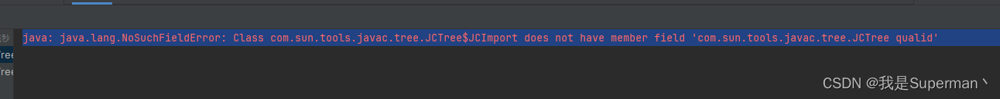
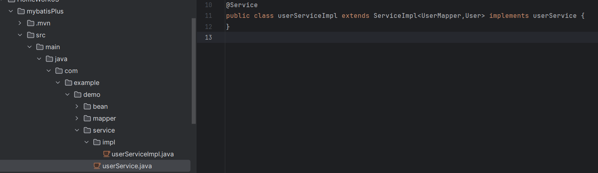

# SpringBoot学习心得
四次课程的SpringBoot学习，从最初的安装idea配置maven到现在对三层架构的了解....
## 1.第一次课程
####  SpringBoot 特性
1. 能够快速创建基于 Spring 的应用程序
2. 能够直接使用内嵌的 Tomcat 服务器运行 SpringBoot 程序，不需要部署 war 包文件
3. 提供约定的 starterPOM 来简化 Maven 配置，让 Maven 的配置变得简单
4. 自动化配置，根据项目的 Maven 依赖配置，Springboot 自动配置 Spring、Springmvc 等
5. 提供了程序的健康检查等功能
6. 基本可以完全不使用 XML 配置文件，采用注解配置

#### Maven 常用命令
1. mvn clean ：清理，这个命令可以用来清理已经编译好的文件
2. mvn compile：编译，将 Java 代码编译成 Class 文件
3. mvn test ：测试 ，项目测试
4. mvn package：打包，根据用户的配置，将项目打成 jar 包或者 war 包
5. mvn install ：安装，手动向本地仓库安装一个 jar
6. mvn deploy ：上传 ，将 jar 上传到私服
### 第一次课后任务（homeWork01）:
java环境配置，idea的安装，学习新建SpringBoot项目

[//]: # (![飞鸟]&#40;C:\Users\lmcay\Desktop\OIP-C.jpg&#41;)
### 遇到的问题：

### 解决方法:
将maven中的lombok依赖版本改为1.18.30可正常运行,具体如下:

``
<dependency>
    <groupId>org.projectlombok</groupId>
    <artifactId>lombok</artifactId>
    <version>1.18.30</version>
</dependency>
``

## 第二次课程
### Mybatis的学习
#### 基于xml的增删改查
1. 新建SpringBoot项目，在pom.xml中添加依赖
2. 在application.properties文件中设置数据库相关信息配置
3. 创建好bean，mapper层结构以及所需的实体类和接口
4. 设置好mapper.xml模板放在resource目录mapper文件夹下并在application.properties文件中配置``mybatis.mapper-locations=classpath:/mapper/*.xml``,该模板内存放的后续需要的增删改查SQL语句
5. 最后在测试类中注入（Autowired）并使用相关接口即可
#### 基于注解的增删改查
基于注解只需在mapper接口中每个方法上添加增删改查相应的注释即可，
只适合简单的数据库操作，较难编写复杂的 SQL 语句。

(1).png)
tips: 在bean实现类上加上``@Data``注解可省略相应的get,set方法。
### 遇到的问题：
在注入mapper时红色警告提示，则需要在相应的mapper接口上加上``@Service``注解，bean内中加上``@Mapper``注解。
## 第三次课程
### Mybatis_plus的学习
#### mapperCRUD     【BaseMapper （mapper层）】
Mybatis_plus 还是和Mybatis一样的创建项目方法，只是不再使用mapper.xml的方式来写入SQL语句，
直接在mapper接口上extends BaseMapper接口来使用其中所自带的SQL方法，极大的增加的开发的效率。
1. insert 增
2. delete 删
3. update 改
4. select 查
#### serviceCRUD        【IService   （service层）】
通过建立service层下接口和创建Impl下实现类

1. 接口中继承IService
2. 实现类中继承ServiceImpl并实现service接口，再添加注解``@Service``

#### 
1. save 增
2. remove 删
3. update 改
4. get 查

最后在Mybatis_plus中可以使用Wrapper条件构造器来更为方便的CRUD
## 第四次课程
1. 了解了各种注解，例如：``@Data``,``@GetMapping``,``@SpringBootApplication``and so on.....
2. 了解了properties和yaml配置文件以及配置文件存放在不同地方的优先级问题。
根目录下的config文件夹中的配置文件>config文件夹下的>resource下
3. 对于SpringBoot的框架体系结构：bean/mapper/controller/service，
规范每个层次的代码极大的提高了编程的效率，以及后续修改的便捷程度。
